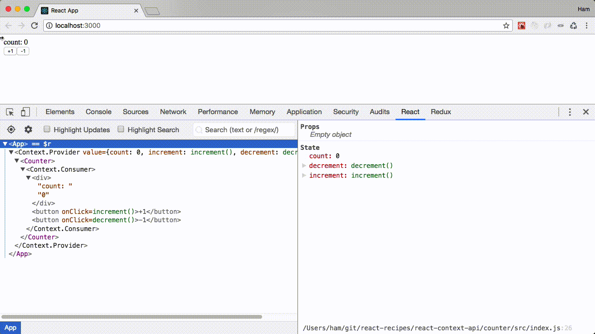

# React Context API

## 背景

* Reactでは、配下のコンポーネントにデータを渡すための手段として`props`という機能があります。ところが、`props`を使用すると、孫コンポーネント、ひ孫コンポーネント、...、というように渡したいコンポーネントまで渡したいデータをバケツリレーのように延々と渡していかなければならない弱点があります。
* その弱点を解消するべく、どのコンポーネントからでも特定のデータにアクセスできる仕組みが`react-redux`から提供されていて、Reduxを使用したことのある人なら大抵の人が恩恵を受けているであろう`Provider`コンポーネントです。
* `Provider`コンポーネントとは文字通り`Provider`コンポーネントでwrapした全コンポーネントに特定のデータを届けることが目的とします。
* その後、Reactは、バージョンv16.3で、Reduxに喧嘩を売っているのか？とまさに耳を疑うような機能を追加しました。`react-redux`の`Provider`とほぼ同様の機能で同名の`Provider`というコンポーネントをリリースしました。
* この記事ではReact側でリリースされた`Provier`を含む[Context](https://reactjs.org/docs/context.html) APIについての紹介と、`Context API`を使用したアプリケーションの実装例について紹介したいと思います。
* 尚、「先にソースコードを見たい！」という方は末尾の[ソースコード](#ソースコード)より`git clone`してください。

## Reactアプリケーションの作成

Reactアプリケーションが必要になりますので以下のコマンドでサクッと作成してしまいます。ちなみに、`npx`は`npm`のv5.2.0で導入されたもので、`create-react-app`のようなグローバルスコープにインストールしてから使用するようなコマンドが、インストールしなくても実行できるようにするためのコマンドです。グローバルスコープにあまり使わないコマンドを導入したくないという方は今回のように`npx`で実行すると良いでしょう。

```bash
$ npx create-react-app counter
$ cd counter
```

念のため、`package.json`の中身を確認しておきましょう。Reactのバージョンが`v16.3`以上でないと以降の動作確認ができませんのでね。

今回確認した時の`package.json`は以下の内容でした。`react`のバージョンが`^16.3.2` となっているので問題ないです。

```javascript
{
  "name": "counter",
  "version": "0.1.0",
  "private": true,
  "dependencies": {
    "react": "^16.3.2",
    "react-dom": "^16.3.2",
    "react-scripts": "1.1.4"
  },
  "scripts": {
    "start": "react-scripts start",
    "build": "react-scripts build",
    "test": "react-scripts test --env=jsdom",
    "eject": "react-scripts eject"
  }
}
```

続いてReactアプリケーションを起動します。

```bash
$ npm start
```

`npm start`を実行するとブラウザが自動起動し、`Welcome to React`のおなじみの画面が表示されるはずです。これが確認できたらエディターに戻って、ファイルを編集します。

## React Context APIの導入したカウンタアプリの例

「React Context APIの導入したカウンタアプリ」の例を以下に記載します。

まずはReactアプリケーションのトップレベルのファイルである`src/index.js`を編集していきます。

編集前は、以下のようになっていると思いますが、一旦全部消去します。

```javascript
import React from 'react';
import ReactDOM from 'react-dom';
import './index.css';
import App from './App';
import registerServiceWorker from './registerServiceWorker';

ReactDOM.render(<App />, document.getElementById('root'));
registerServiceWorker();
```

そして、`src/index.js`を以下のように書き換えます。

```javascript
import React from 'react';
import ReactDOM from 'react-dom';
import { CounterContext } from './contexts/counter'
import Counter from './components/counter'

class App extends React.Component {
  constructor(props) {
    super(props)

    this.state = {
      count: 0,
      increment: () => this.setState(state => ({count: state.count + 1})),
      decrement: () => this.setState(state => ({count: state.count - 1}))
    }
  }

  render() {
    return (
      <CounterContext.Provider value={this.state} >
        <Counter />
      </CounterContext.Provider>
    )
  }
}

ReactDOM.render(<App />, document.getElementById('root'));
```

以下の点がポイントになります。

* contextの作成は`src/index.js`ではやらず別ファイルに分離しています。大規模なアプリケーションを想定するとおそらく別のファイルに分離しないとカオスになると思われるためです。というのも、contextは実質無限個作成できるからです。
* contextと同様の理由でcomponentも別ファイルに分離しました。これはReactアプリケーションを書く人なら既に身についているであろう慣習です。
* 状態はReactの基本機能であるstateで管理します。状態遷移についてもReactの`setState`で行います。なのでReduxで書くときとは違い、stateの変更とそれを誘発するイベントがコンポーネントにべったりな点は、Reduxアプリを書き慣れている人で何でもかんでも分離したがる潔癖症な人にとってはかなりキモいコードと感じてしまうかもしれません。
* importしたCounterContextに紐づく`CounterContext.Provider`というコンポーネントで渡したい状態を受け取るコンポーネントをwrapします。
* `Provider`ではなく`CounterContext.Provider`と表記しているのは、今回のケースでは、`Provider`でも良かったんですがContextは無数存在し得る物なのでどのProviderなのかを識別できるよう`CounterContext.`というプレフィックスにより名前空間を識別する習慣を付けないと後々アプリケーションが大規模になってきて複数のContextが入り乱れるようになってときにリファクタリングを強いられると思うのでそうしています。
* ProvierでConsumerに渡したい状態を`value=`で渡しています。

### Counterコンポーネント

続いてCounterコンポーネントを作成します。　

```bash
$ mkdir src/components
$ touch src/components/counter.js
```

エディターで以下のように編集します。

```javascript
import React from 'react';

import { CounterContext } from '../contexts/counter'

const Counter = () => (
  <CounterContext.Consumer>
    {
      ({ count, increment, decrement }) =>  {
        return (
          <React.Fragment>
            <div>count: {count}</div>
            <button onClick={increment}>+1</button>
            <button onClick={decrement}>-1</button>
          </React.Fragment>
        )
      }
    }
  </CounterContext.Consumer>
)

export default Counter
```

以下の点がポイントになります。

* カウンタコンポーネントはConsumerコンポーネントを有するコンポーネントです。なので冒頭で該当のContextをimportしています。
* `CounterContext.Consumer`と表記しているのは、`CounterContext.Provider`と表記しているのと同じ理由からです。(上述)
* Consumerの内部のchildは関数であり必須です。関数を書いてください。
* Consumer内部の関数の引数で、Providerが渡してくれたvalueを受け取ることができます。今回のアプリケーションでは、カウンタの値、インクリメントの関数、デクリメントの関数を受け取ることができます。
* Consumer側では受け取った値を適当な場所に表示させたり、受け取った処理を適当なイベントハンドラに渡したりすれば良いです。

### CounterContextの作成

最後にカウンタ専用の`CounterContext`を作成します。

```bash
$ mkdir src/contexts
$ touch src/contexts/counter.js
```

`src/contexts/counter.js`を以下のように編集します。

```javascript
import { createContext } from 'react';

export const CounterContext = createContext({
  count: null,
  increment: () => {},
  decrement: () => {}
})
```

コンテキストは即ちProviderとConsumer間で共有したい状態や処理です。createContextの引数には上記のようにオブジェクトをデフォルト値として渡すことができます。countを0にしても良いのですが初期化は今回の実装ではコンポーネントで実行させるポリシーにしています。

## デモ画面

という感じで、以下の画面ようにカウンタアプリがブラウザに表示され動作すると思います。




## ソースコード

本記事で扱った動作確認のとれているソースコードは[GitHub](https://github.com/ProgrammingSamurai/react-recipes)に公開しています。書くのが面倒という方は下記コマンドで`git clone`してください。

```bash
$ git clone git@github.com:ProgrammingSamurai/react-recipes.git
```

## 告知

先日、Udemy講師デビューを果たしました。「[フロントエンドエンジニアのためのReact・Reduxアプリケーション開発入門](https://goo.gl/M1V3sD)」というコースを公開中です。これからReactをやってみようとお考えの方は是非始めてみてください！こちらの[リンク](https://goo.gl/M1V3sD)から95%オフで購入できます。ご質問も大歓迎です！ :)
